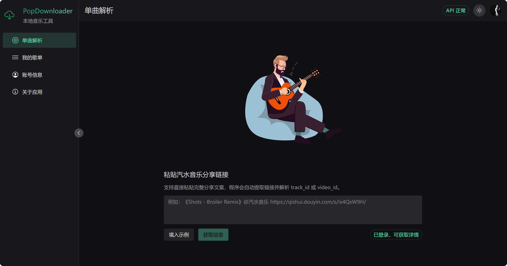
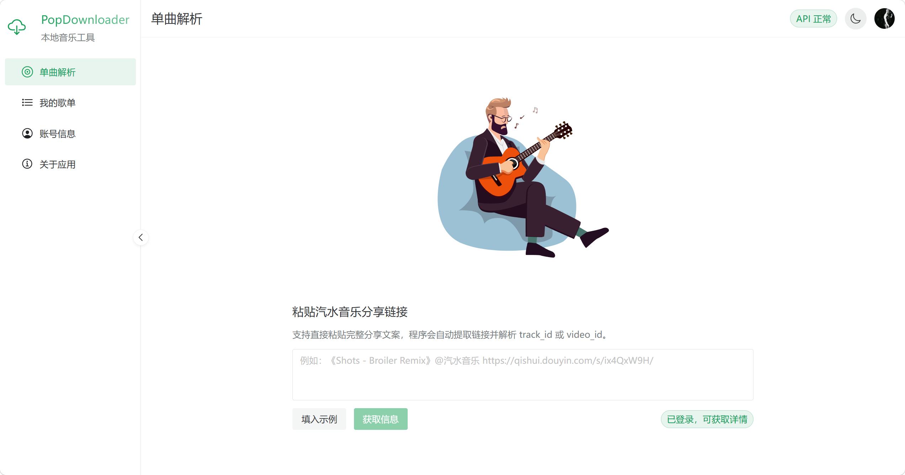
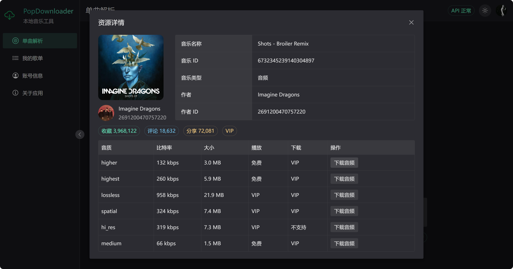
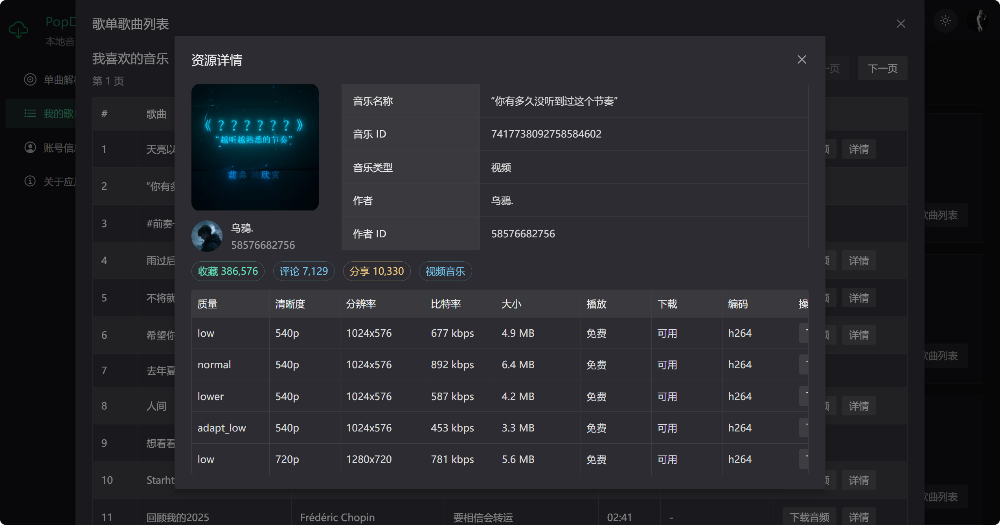
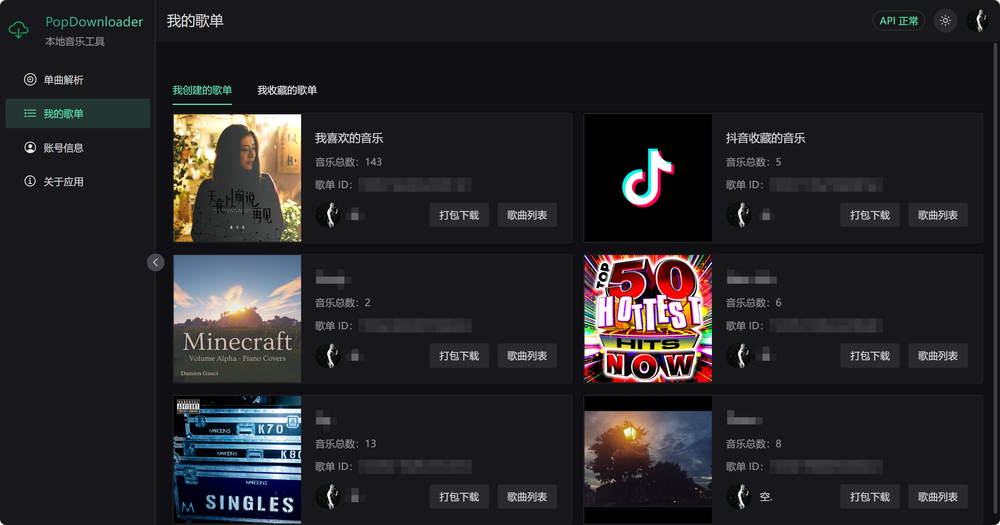
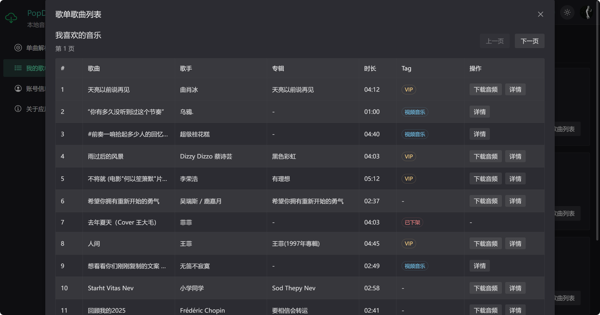
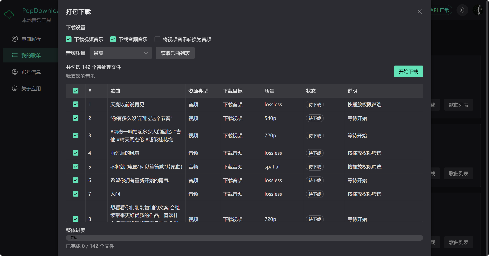
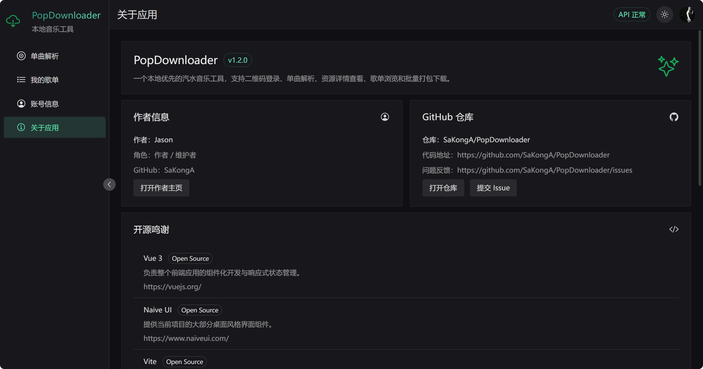

# PopDownloader FIXED 🎵

一个本地优先的汽水音乐工具，基于 Vue 3、Naive UI、Vite 和 Express 构建。  
它把登录、解析、查看详情、单曲下载、歌单浏览和批量打包下载这些常用能力整合到了一个本地应用里。

## 🖼️ 界面预览

### 单曲解析



### 单曲解析（浅色）



### 资源详情 - 音乐



### 视频详情



### 我的歌单



### 歌曲列表



### 打包下载



### 关于应用



## 🚀 当前功能

### 1\. 一键登录

* 自动读取汽水音乐 PC 端本地 Cookies 中的登录态
* 支持登录后自动拉取当前账号信息
* 支持退出登录并清空本地登录状态
* 自动探测汽水音乐 PC 端安装路径与版本

### 2\. 单曲解析

* 支持直接粘贴汽水音乐分享文案
* 支持从分享文案中自动提取链接
* 支持请求分享页 HTML 并解析 `track\\\_id` / `video\\\_id`
* 支持单曲详情弹窗展示
* 支持区分音频资源和视频资源
* 支持展示对应资源的可用质量信息

### 3\. 音频资源详情

* 支持展示歌曲名称、歌曲 ID、作者信息
* 支持展示收藏数、评论数、分享数
* 支持展示音质、比特率、大小、播放权限、下载权限
* 支持根据账号权限判断可不可下载
* 支持下载音频加密文件
* 支持写入 FLAC 元数据与封面

### 4\. 视频资源详情

* 支持展示视频资源基础信息
* 支持展示质量、清晰度、分辨率、比特率、大小、编码
* 支持下载视频文件
* 支持提取视频中的音频并下载

### 5\. 我的歌单

* 支持查看“我创建的歌单”
* 支持查看“我收藏的歌单”
* 支持展示歌单封面、标题、曲目数量、拥有者信息

### 6\. 歌单详情

* 支持查看歌单内的资源列表
* 支持从歌单中查看音频 / 视频资源详情
* 支持复用统一的资源详情弹窗

### 7\. 批量打包下载 📦

* 支持对歌单资源生成批量下载任务
* 支持勾选要处理的任务
* 支持下载音频音乐
* 支持下载视频音乐
* 支持将视频音乐转换为音频
* 支持按偏好选择音频质量（最高 / 最低）
* 支持把多个文件打包成 ZIP 下载
* 支持按“已完成文件数”显示实时整体进度
* 支持在任务表里展示每个任务的状态与说明

### 8\. 账号信息页

* 支持展示当前登录账号信息
* 支持显示昵称、ID、头像、会员状态等内容

### 9\. 界面与交互

* 支持浅色 / 深色主题切换
* 支持侧边栏页面导航
* 支持首页动画展示
* 支持桌面风格的管理型界面布局

## 🧱 技术栈

* Vue 3
* Naive UI
* Vite
* Express
* Archiver
* fluent-ffmpeg
* ffmpeg-installer
* flac-tagger
* lottie-web
* @vicons/ionicons5

## 🛠️ 运行环境

* Node.js 20.19+ 或 22.12+（Vite 8 的要求；GitHub Actions 工作流使用 Node 22）
* npm 9 及以上

## 📥 安装依赖

```bash
npm install
```

## 💻 开发运行

同时启动前端和本地服务：

```bash
npm run dev
```

默认会启动：

* Vite 前端开发服务
* Express 本地接口服务

## 🏗️ 生产构建

```bash
npm run build
```

## ▶️ 本地启动

构建完成后可直接运行：

```bash
npm run start
```

## 📦 打包 Windows 客户端（exe）

本地打包（会生成 NSIS 安装包 + 免安装绿色版两个 exe）：

```bash
npm run dist
```

产物在 `release/` 目录（已加入 `.gitignore`，不提交进仓库）。

> `better-sqlite3` 是原生模块：本地执行过 `npm run dist` 之后，`node_modules` 里它的二进制
> 会变成 Electron ABI 的版本，此时再单独跑 `npm run start`（用系统 Node）可能报 ABI 不匹配。
> 需要切回来时执行一次 `npm run rebuild:native` 对应的反向重建，或重新 `npm ci` 即可；
> 正常走 `npm run dev` / `npm run dist` 不受影响。

### 用 GitHub Actions 云端打包

仓库内置工作流 [.github/workflows/build-windows.yml](.github/workflows/build-windows.yml)，
**只有两种触发方式**，普通 push 不会出包：

| 触发方式 | 结果 |
| --- | --- |
| 推送 `v*` 标签（如 `v1.0.0`） | 自动构建 + 创建 GitHub Release 并附上 exe |
| Actions 页面手动 `Run workflow` | 只构建，exe 放在 Artifact 里下载 |

发版步骤：

```bash
# 1. 先把 package.json 的 version 改成 1.0.1
# 2. 提交后打上同名 tag（工作流会校验两者是否一致，不一致直接失败）
git commit -am "chore: release v1.0.1"
git tag v1.0.1
git push origin HEAD --tags
```

> 不想打 tag 也可以：到仓库 **Actions → Build Windows Package → Run workflow** 手动跑一次，
> 构建完成后在该次运行页面底部下载 Artifact。

工作流会自动完成：`npm ci` → 初始化 MSVC 环境 → 为 Electron 重建 `better-sqlite3`
（优先取预编译包，取不到再源码编译）→ `vite build` → `electron-builder --win` →
**启动打好的 exe 做冒烟测试**（探测 `/api/health` 与前端入口，防止打出能编译但一打开就崩的包）
→ 上传产物。

> 注意：exe 体积接近百 MB，超过 GitHub 单文件 100MB 的入库限制，
> 所以产物只作为 Release 附件 / Artifact 分发，不要提交进仓库。

#### 两个容易踩的坑（已修复，改动前请先看）

1. **runner 必须固定在 `windows-2022`，不要改成 `windows-latest`。**
   `windows-latest` 标签现已指向「Windows Server 2025 + Visual Studio 2026」镜像
   （见 [actions/runner-images 标签映射表](https://github.com/actions/runner-images)）。
   `better-sqlite3` 依赖的 `node-gyp` 探测不到 VS 2026，会报
   `Could not find any Visual Studio installation to use`，导致原生模块重建失败、直接中断构建。
2. **`package.json` 里刻意不保留 `postinstall`。**
   原先的 `postinstall: electron-builder install-app-deps` 会让 `npm ci` 阶段就触发原生模块编译，
   工具链一旦有问题，失败点会伪装成「npm ci 失败」，很误导。
   现在重建集中在工作流的专用步骤里，失败原因一眼可见。

⚠️ 工作流文件走的是「该 tag 所指向的那次提交」里的版本。改了工作流之后，
**必须先把改动提交并推送，再打 tag**，否则跑的仍是旧工作流。

## 📁 项目结构

```text
PopMusic/
├─ README-assets/           README 截图
├─ src/                     前端页面、组件与 API 封装
│  ├─ pages/                页面
│  ├─ components/           组件
│  ├─ api/                  前端接口请求
│  ├─ assets/               前端静态资源
│  └─ utils/                前端工具函数
├─ server/                  本地 Express API 与下载逻辑
│  ├─ apis/                 接口定义
│  ├─ config/               配置
│  └─ utils/                下载、解析、解密等工具
├─ index.html               前端入口 HTML
├─ vite.config.mjs          Vite 配置
└─ package.json             项目依赖与脚本
```

## 🔐 关于登录

* 当前仅支持一键登录：自动读取本机汽水音乐 PC 端的登录态（`sessionid`），无需扫码或手动输入参数
* 登录状态依赖本地保存的 `sessionid`，不会上传云端
* 一键登录仅在 Windows 环境下可用，并依赖汽水音乐 PC 端本地 Cookies
* 使用一键登录前，需要保证汽水音乐 PC 端已经登录

## 🧭 安装路径自动探测

* 应用启动后会自动探测汽水音乐 PC 端的安装目录与版本号
* 探测顺序：`SODA\\\_MUSIC\\\_HOME` 环境变量 → 各磁盘分区根目录下的 `Soda Music` → `Program Files` / `AppData\\\\Local` 等常见位置
* 在版本目录（如 `2.6.3`、`3.1.2`、`3.5.1`）中自动选择最高版本，并校验 `resources/app.asar.unpacked/bdms.node` 是否存在
* 下载能力依赖汽水音乐 PC 端自带的 `bdms.node` 签名模块，无需额外配置
* 同时会读取 `%AppData%\\\\SodaMusic\\\\DeviceV1` 中的设备信息用于请求签名
* 可通过 `GET /api/environment` 查看探测结果，便于排查环境问题

## 🛠️ 修复内容

* api更新导致无法下载的问题（track\_v2 风控，已接入官方客户端 bdms 签名）
* 汽水音乐 PC 端安装路径硬编码，导致签名模块找不到（现已自动探测，详见「安装路径自动探测」）
* 某些问题导致批量下载失败的问题
* 移除过时的文件登录、扫码登录、参数登录，仅保留一键登录


## 👥 作者与仓库

* 原作者：[Jason（SaKongA）](https://github.com/SaKongA)
* 维护者：[YYF1337](https://github.com/YYF1337)
* 原仓库：[SaKongA/PopDownloader](https://github.com/SaKongA/PopDownloader)
* 当前维护仓库：[YYF1337/PopDownloader](https://github.com/YYF1337/PopDownloader)
* 问题反馈：[提交 Issue](https://github.com/YYF1337/PopDownloader/issues)

## 🙏 特别感谢

本项目在解密与相关实现思路上，参考了以下开源项目，特此感谢：

* SodaDownloader  
https://github.com/baizeyv/SodaDownloader
* music-lib  
https://github.com/guohuiyuan/music-lib
* qishui-decrypt  
https://github.com/naiyQAQ/qishui-decrypt

## 📌 TODO

* 增加其他登录方式（如扫码登录等），以便未在 PC 端登录的场景也能使用

## ⛔️ 免责声明

* PopDownloader 仅作为学习交流使用，不涉及任何破解、绕过会员限制获取音频的功能，如有侵权，请联系作者删除！

